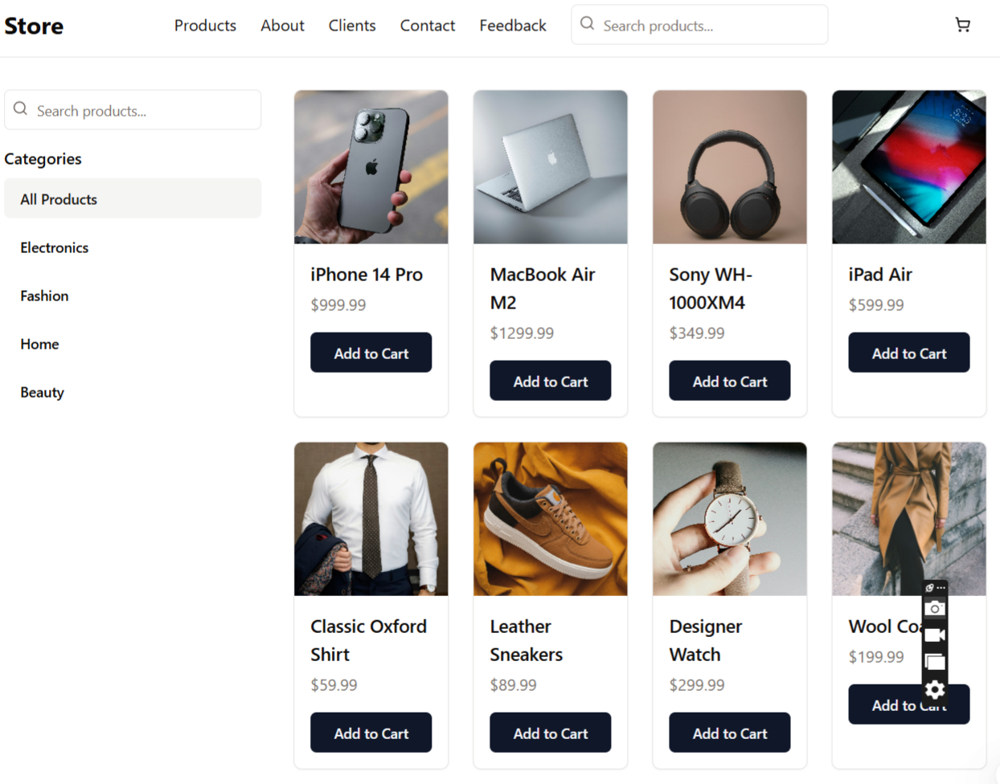

<h2>🛍️ E-Commerce App with Next.js</h2><br/>
Welcome to the E-Commerce App built with Next.js! This project showcases a modern online shopping experience, utilizing the latest technologies to provide a seamless user interface and efficient backend.

<h3>🌟 Introduction to Our Company</h3><br/>
At Customer Centric Tech Company, we are passionate about creating innovative solutions that meet the evolving needs of our clients. Our team of skilled developers and designers is dedicated to delivering high-quality applications that enhance user experiences and drive business success.



<h3>📦 Project Installation</h3><br/>
# Clone or download the project
# Install dependencies
npm install
# The project uses these main packages:
- React with TypeScript for the frontend
- Express for the backend
- Drizzle ORM for database management
- TanStack Query for data fetching
- Zustand for state management
  Database Setup:
# The project uses PostgreSQL database
# Environment variables needed (already set up in Replit):
- DATABASE_URL: PostgreSQL connection string
- PGHOST: Database host
- PGPORT: Database port
- PGUSER: Database user
- PGPASSWORD: Database password
- PGDATABASE: Database name
# After setting up environment variables, run:
npm run db:push
Running the Project:

<h3>🚀 Running the Project</h3><br/>
# Development mode
npm run dev
# or
yarn dev
# or
pnpm dev
# or
bun dev
```

Open [http://localhost:3000](http://localhost:3000) with your browser to see the result.

You can start editing the page by modifying `app/page.tsx`. The page auto-updates as you edit the file.

This project uses [`next/font`](https://nextjs.org/docs/app/building-your-application/optimizing/fonts) to automatically optimize and load [Geist](https://vercel.com/font), a new font family for Vercel.

## Learn More

To learn more about Next.js, take a look at the following resources:

- [Next.js Documentation](https://nextjs.org/docs) - learn about Next.js features and API.
- [Learn Next.js](https://nextjs.org/learn) - an interactive Next.js tutorial.

You can check out [the Next.js GitHub repository](https://github.com/vercel/next.js) - your feedback and contributions are welcome!

## Deploy on Vercel

The easiest way to deploy your Next.js app is to use the [Vercel Platform](https://vercel.com/new?utm_medium=default-template&filter=next.js&utm_source=create-next-app&utm_campaign=create-next-app-readme) from the creators of Next.js.

Check out our [Next.js deployment documentation](https://nextjs.org/docs/app/building-your-application/deploying) for more details.
